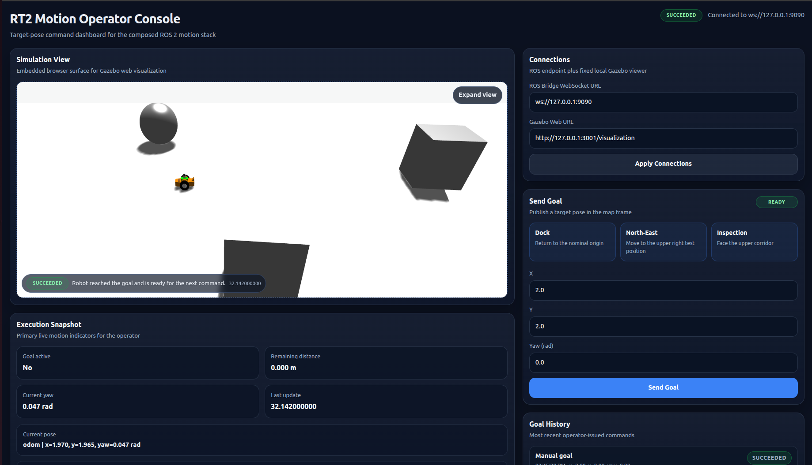

<div align="center">

# MogiBot Motion Stack

A composable ROS 2 motion stack with a browser-based operator interface.

Gazebo Harmonic · ROS 2 Humble · React + TypeScript · rosbridge


<br>



</div>

---

MogiBot is a web-operated navigation stack for a differential-drive robot simulated in Gazebo Harmonic. The operator drives the robot from a browser, submitting target poses, watching execution live, and inspecting the scene through an embedded Gazebo viewer. A pair of composable ROS 2 nodes handles goal bridging and motion execution on the backend.

The project is built around ROS 2 composition: the same two components deploy inside a single container or split across two, without any change to node logic.

## Highlights

- Two composable nodes (`MotionExecutorComponent` and `GoalBridgeComponent`), deployable in a shared or split container layout.
- Action-based pose execution through a custom `ExecuteTargetPose` action, with feedback and result streamed back to the UI.
- Web operator dashboard (React + TypeScript) with manual and preset pose targets, live status, and goal history.
- Embedded Gazebo visualization served through the `gazebosim-app` viewer.
- rosbridge integration for browser to ROS 2 communication.
- `tf2`-based frame handling for transforming requested goals and extracting yaw from odometry.
- Proportional target-pose controller: simple, interpretable, and fully readable.

The stack is organized in four layers: simulation (Gazebo and topic bridges), motion (the two components, the action server, and tf2-based frame handling), browser integration (rosbridge and the Gazebo web viewer), and the operator UI.

## Requirements

| | |
|---|---|
| OS | Ubuntu 22.04 |
| ROS 2 | Humble |
| Simulator | Gazebo Harmonic |
| Bridges | `ros_gz`, `rosbridge_server` |
| Container | Docker |
| Frontend | Node.js 20+, npm |

## Installation

```bash
git clone https://github.com/Cb-dotcom/Assignment1_RT2.git
cd Assignment1_RT2
git submodule update --init --recursive
```

Build the ROS 2 workspace:

```bash
source /opt/ros/humble/setup.bash
colcon build --packages-select \
    bme_gazebo_sensors_interfaces \
    bme_gazebo_sensors \
    bme_gazebo_sensors_bringup
source install/setup.bash
```

Install the Web UI:

```bash
cd web_ui
npm install
cp .env.example .env
```

Typical `.env` values:

```env
VITE_ROSBRIDGE_URL=ws://127.0.0.1:9090
VITE_GAZEBO_WEB_URL=http://127.0.0.1:3001/visualization
```

Build the embedded Gazebo viewer:

```bash
cd tools/gazebosim-app
docker build -t gazebosim-app .
```

## Running the Stack

Launch from three terminals.

### 1. ROS 2 and simulation

```bash
ros2 launch bme_gazebo_sensors_bringup full_system.launch.py
```

### 2. Gazebo web viewer

```bash
docker run --rm -p 3001:3001 \
    -e GZ_WEBSOCKET_URL=ws://127.0.0.1:9002 \
    -e GZ_WEBSOCKET_AUTOCONNECT=1 \
    gazebosim-app
```

### 3. Web UI

```bash
cd web_ui && npm run dev
```

Open the UI in a browser. Confirm that rosbridge is connected and the embedded simulation view is rendering, then submit a preset or manual goal.

## Composition Modes

The motion stack provides two launch files that deploy the same components differently.

### Shared container (`full_system.launch.py`)

Both components run inside a single `component_container`. Lower process overhead, tighter integration, and the default for day-to-day use.

```bash
ros2 launch bme_gazebo_sensors_bringup full_system.launch.py
```

### Split container (`full_system_split.launch.py`)

Each component runs in its own container:

- `MotionExecutorComponent` runs in container A
- `GoalBridgeComponent` runs in container B

Cleaner failure isolation, easier per-component debugging, and a demonstration of deployment flexibility. Component source and behavior are identical across the two modes.

```bash
ros2 launch bme_gazebo_sensors_bringup full_system.launch.py rviz:=true
```

## Components

### `MotionExecutorComponent`

Hosts the `ExecuteTargetPose` action server and runs the control loop.

- Validates incoming goals against configured tolerances.
- Computes position and heading errors from odometry, using `tf2` for yaw extraction from quaternions.
- Rotates in place until aligned, then drives forward proportionally.
- Publishes `cmd_vel`, emits feedback during execution, and issues a stop on completion, preemption, or abort.

### `GoalBridgeComponent`

Connects the browser to the action server.

- Subscribes to pose targets submitted through rosbridge.
- Validates and uses `tf2` to transform requested poses from `map` into the execution frame `odom` before forwarding.
- Acts as an action client to `MotionExecutorComponent`.
- Publishes `MotionUiStatus` for the UI to consume.

## Interfaces

Defined in `bme_gazebo_sensors_interfaces/`:

| Type | Name |
|---|---|
| Action | `ExecuteTargetPose.action` |
| Message | `MotionUiStatus.msg` |

## Web UI

React + TypeScript, bundled with Vite. Features:

- Manual target-pose entry
- Preset goal buttons
- Live execution state
- Goal history

Talks to ROS 2 through `rosbridge_server` on `ws://127.0.0.1:9090`.

## Repository Layout

```text
.
├── bme_gazebo_sensors/              # robot description, worlds, meshes, RViz config
├── bme_gazebo_sensors_bringup/      # launch files and configs
├── bme_gazebo_sensors_interfaces/   # actions and messages
├── web_ui/                          # React + TS operator dashboard
└── tools/
    └── gazebosim-app/               # Gazebo web viewer (submodule)
```

## Documentation

Extended documentation will be provided through:

- Sphinx for architecture, controller design, launch strategies, and composition comparison.
- Doxygen for code-level API reference.

## Author

<a href="https://github.com/Cb-dotcom/Assignment1_RT2/graphs/contributors">
  
</a>
<br><br>